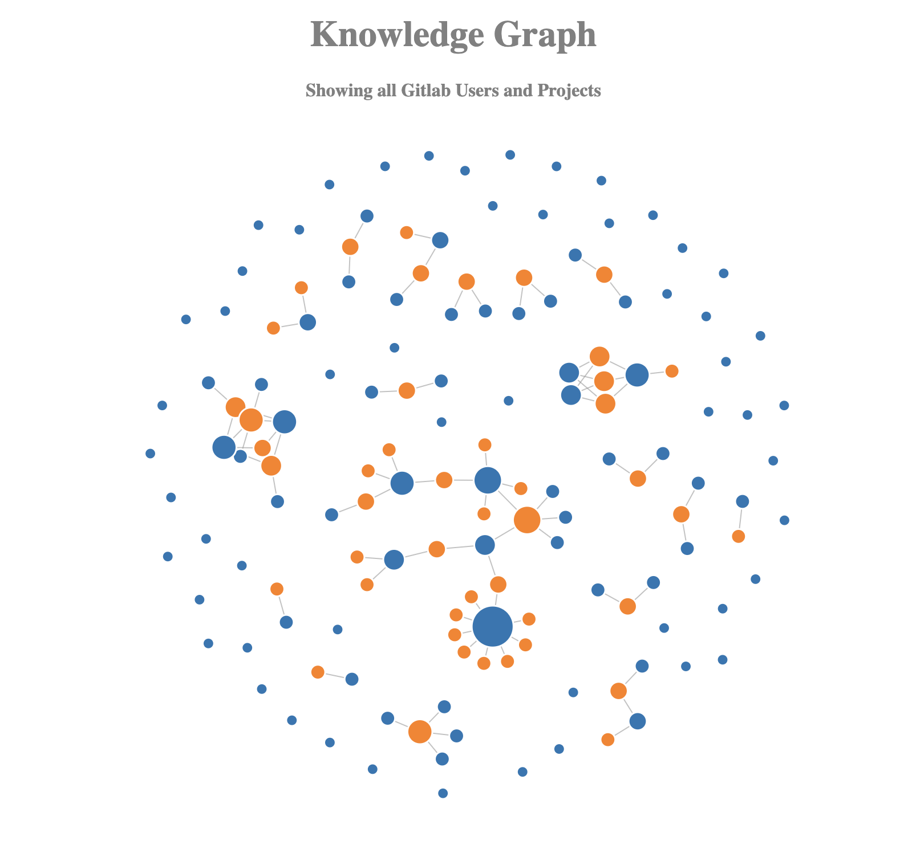

# Knowledge Graph
This graph shows all the users and projects from a gitlab instance (assuming the token used has full access).


## Generate Data
To generate the graph data, you will need a get token. go to your gitlab instance and generate a token. Once you 
have a token, set the GITLAB_TOKEN environment variable.

Set the GITLAB_HOST env var e.g. 
```
GITLAB_HOST=https://gitlab.turntabl.net
```

cd into the app folder and install the dependencies:
```
npm install
```
Then run the `get-data.js` script. This will create a file called `graph-data.json` in the `viz/files` directory. 
You may first need to create the `files` subdirectory in the `viz` subfolder.
```
node get-data.js
```


## Visualise Graph
Once you have generated the data, to visualise the graph, cd into the viz folder and start a simple web server e.g.

Python Web Server
```
python3 -m http.server
```

Go to the `http://localhost:8000` (This is the default port for the python webserver. if you use another web server, 
insert the correct port)